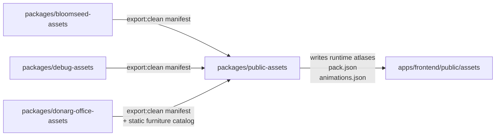
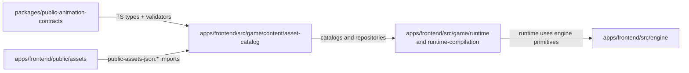

# Packages

This directory contains the frontend asset source packages plus the shared export and contract packages that turn those sources into runtime data for `apps/frontend`.

`farmrpg-assets/` is intentionally not covered here. It was added recently and is not wired into the stable pipeline yet.

When this README says `game/...` or `engine/...`, the real repo paths are under `apps/frontend/src/game/...` and `apps/frontend/src/engine/...`.

## Roles

- `bloomseed-assets/`, `debug-assets/`, `donarg-office-assets/`: source-of-truth art packages. They export normalized clean manifests and frame PNGs from Aseprite sources.
- `public-assets/`: the shared packager. It runs each source package's `export:clean`, validates the results, builds frontend atlases and animation manifests, and writes them into `apps/frontend/public/assets`.
- `public-animation-contracts/`: generated TypeScript contracts and validators for public animation manifests. Frontend content code imports these types when reading animation data.

The root workspace treats `public-assets/` as the canonical shared export step:

```json
"dev:frontend": "sh -c 'npm run assets:public && npm run -w @towncord/frontend dev -- \"$@\"' --",
"build:frontend": "npm run assets:public && npm run -w @towncord/frontend build",
"assets:public": "npm run -w @towncord/public-assets export:public"
```

Source packages still keep package-local `export:public` commands for focused iteration, but the shared frontend build path goes through `@towncord/public-assets`.

## Package Pipeline



### Why those arrows exist

`bloomseed-assets/`, `debug-assets/`, and `donarg-office-assets/` all feed `public-assets/` through `export:clean` plus a package-local `build/public-source/manifest.json`:

```py
NAMESPACE_CONFIGS = (
    NamespaceConfig(
        source_package="@towncord/bloomseed-assets",
        manifest_path=WORKSPACE_ROOT / "packages" / "bloomseed-assets" / "build" / "public-source" / "manifest.json",
        output_slug="bloomseed",
        ...
    ),
    NamespaceConfig(
        source_package="@towncord/debug-assets",
        manifest_path=WORKSPACE_ROOT / "packages" / "debug-assets" / "build" / "public-source" / "manifest.json",
        output_slug="debug",
        ...
    ),
    NamespaceConfig(
        source_package="@towncord/donarg-office-assets",
        manifest_path=WORKSPACE_ROOT / "packages" / "donarg-office-assets" / "build" / "public-source" / "manifest.json",
        output_slug="donarg-office",
        ...
    ),
)

def run_clean_export(config: NamespaceConfig) -> None:
    command = ["npm", "run", "-w", config.source_package, "export:clean"]
```

Source: `packages/public-assets/pipeline/export_public_assets.py`

Each source package writes that clean manifest. Example from Bloomseed:

```py
manifest = {
    "schemaVersion": 1,
    "sourcePackage": "@towncord/bloomseed-assets",
    "namespace": exporter.NAMESPACE,
    "outputSlug": exporter.NAMESPACE,
    "packSection": exporter.NAMESPACE,
    "animationManifestKey": "bloomseed.animations",
    ...
}

write_json(clean_root / "manifest.json", manifest)
```

Source: `packages/bloomseed-assets/pipeline/export_clean_from_aseprite.py`

`public-assets/` then materializes the frontend runtime files under `apps/frontend/public/assets/<slug>`:

```py
namespace_root = WORKSPACE_ROOT / "apps" / "frontend" / "public" / "assets" / config.output_slug
clear_namespace_root(namespace_root)
write_atlas(namespace_root, placements, (atlas_width, atlas_height))
write_pack(namespace_root, config, list(manifest["logicalAtlasKeys"]), seed)
write_animations(namespace_root, config, public_animations)
copy_static_public_files(namespace_root, config)
```

Source: `packages/public-assets/pipeline/export_public_assets.py`

## Frontend Consumption



### Why those arrows exist

`public-animation-contracts/` is the package that matches the requested `public-asset-contracts` role. The frontend content layer imports its manifest types directly:

```ts
import type {
  PublicAnimationDefinition,
  PublicAnimationManifest,
} from "@towncord/public-animation-contracts";
```

Source: `apps/frontend/src/game/content/asset-catalog/donargOfficeManifest.ts`

`apps/frontend/public/assets` is exposed to content code through the Vite `public-assets-json:` import bridge:

```ts
const PUBLIC_ASSETS_ROOT = path.resolve(__dirname, "./public/assets");

const filePath = await resolvePublicJsonImportFilePath(relativeAssetPath, {
  publicAssetsRoot: PUBLIC_ASSETS_ROOT,
  fallbackEntries: PUBLIC_JSON_FALLBACKS,
});
```

Source: `apps/frontend/vite.config.ts`

The content layer then imports concrete files from that public tree:

```ts
import terrainRulesetJson from "public-assets-json:terrain/rulesets/phase1.json";
import terrainSeedJson from "public-assets-json:terrain/seeds/phase1.json";
```

Source: `apps/frontend/src/game/content/asset-catalog/terrainContentRepository.ts`

Runtime bootstrap code consumes the asset catalog:

```ts
import type { AnimationCatalog } from "../../../content/asset-catalog/animationCatalog";
import { buildAnimationCatalog } from "../../../content/asset-catalog/animationCatalog";

export function composeRuntimeBootstrap(
  animationKeys: string[],
): RuntimeBootstrapBundle {
  const catalog = buildAnimationCatalog(animationKeys);
  ...
}
```

Source: `apps/frontend/src/game/application/runtime-compilation/load-plans/runtimeBootstrap.ts`

Runtime assemblies then consume engine primitives:

```ts
import {
  TerrainRuntime,
  UnifiedCollisionMap,
  WorldRuntimeCameraController,
  WorldRuntimeDiagnosticsController,
  WorldRuntimeInputRouter,
  createTerrainNavigationService,
  doesFurnitureBlockMovement,
  type WorldNavigationService,
} from "../../../engine";
```

Source: `apps/frontend/src/game/runtime/world/worldSceneAssembly.ts`

## Short Version

- Source asset packages produce clean manifests and frame images.
- `public-assets/` converts those into the shared `apps/frontend/public/assets` runtime format.
- `public-animation-contracts/` gives the frontend typed access to the animation manifests emitted by that pipeline.
- `apps/frontend/src/game/content/asset-catalog` is the bridge from generated public assets into runtime bootstrap and scene code.
